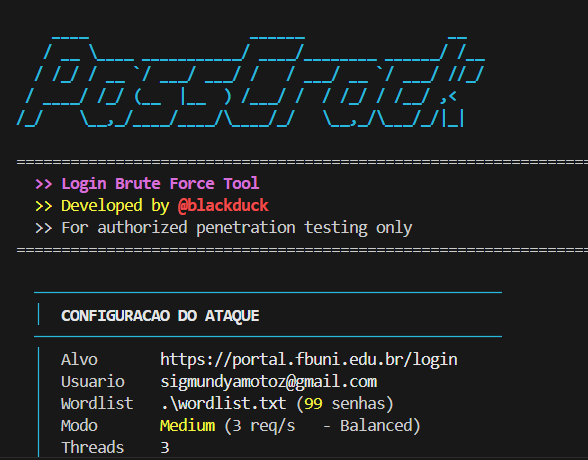

# PassCrack
**Login Brute Force Tool** desenvolvida por **@blackduck**

<p align="center">
  
</p>

Ferramenta de teste de forca bruta para formularios de login web. Desenvolvida para uso em **testes de penetracao autorizados** e ambientes de laboratorio.

---

## Indice

- [Funcionalidades](#funcionalidades)
- [Requisitos](#requisitos)
- [Instalacao](#instalacao)
- [Uso](#uso)
  - [Comando Basico](#comando-basico)
  - [Modos de Velocidade](#modos-de-velocidade)
  - [Opcoes Completas](#opcoes-completas)
  - [Exemplos Praticos](#exemplos-praticos)
- [Como Funciona](#como-funciona)
- [Deteccao de Sucesso](#deteccao-de-sucesso)
- [Estrutura do Projeto](#estrutura-do-projeto)
- [Disclaimer](#disclaimer)

---

## Funcionalidades

- **Auto-deteccao de formularios** - Analisa o HTML da pagina e encontra automaticamente os campos de usuario, senha e action do form
- **Deteccao de CSRF tokens** - Identifica e envia tokens CSRF automaticamente (compativel com Django, Laravel, Rails, etc.)
- **4 modos de velocidade** - De stealth (1 req/s) ate insane (sem limites)
- **Deteccao inteligente de sucesso** - Via redirect, fail-string, success-string ou heuristicas automaticas
- **Interface visual** - Banner ASCII, barra de progresso, spinner animado e cores no terminal
- **Rotacao de User-Agent** - Alterna entre diferentes User-Agents a cada requisicao
- **Multi-threaded** - Execucao paralela com controle de concorrencia
- **Resultado salvo** - Credenciais encontradas sao salvas em `result.txt`
- **Interrupcao limpa** - `Ctrl+C` para encerrar a qualquer momento

---

## Requisitos

- Python 3.8+
- pip

### Dependencias

| Pacote          | Versao  | Funcao                          |
|-----------------|---------|----------------------------------|
| requests        | >= 2.28 | Requisicoes HTTP                 |
| beautifulsoup4  | >= 4.9  | Parsing HTML dos formularios     |

---

## Instalacao

### 1. Clonar o repositorio

```bash
git clone https://github.com/blackduck/passcrack.git
cd passcrack
```

### 2. Criar ambiente virtual (recomendado)

```bash
python -m venv venv

# Windows
venv\Scripts\activate

# Linux / macOS
source venv/bin/activate
```

### 3. Instalar dependencias

```bash
pip install -r requirements.txt
```

---

## Uso

### Comando Basico

```bash
python pass_crack.py <URL> --user <USUARIO> --passfile <WORDLIST> [MODO]
```

### Modos de Velocidade

| Flag       | Threads | Velocidade | Descricao                                      |
|------------|---------|------------|-------------------------------------------------|
| `--easy`   | 1       | 1 req/s    | Modo stealth - discreto, evita rate limiting    |
| `--medium` | 3       | 3 req/s    | Balanceado - velocidade e discricao (padrao)     |
| `--hard`   | 10      | 10 req/s   | Agressivo - rapido, pode acionar protecoes       |
| `--insane` | 50      | Ilimitado  | Sem freio - maximo de velocidade possivel        |

> Se nenhum modo for especificado, o padrao e `--medium`.

### Opcoes Completas

```
Argumentos obrigatorios:
  url                   URL da pagina de login
  --user USER           Usuario para testar
  --passfile ARQUIVO    Caminho para a wordlist de senhas

Modos de velocidade (mutuamente exclusivos):
  --easy                1 req/s - Modo stealth
  --medium              3 req/s - Balanceado
  --hard                10 req/s - Agressivo
  --insane              Sem limite - Maximo possivel

Opcoes de deteccao:
  --fail-string TEXTO   Texto que aparece na resposta quando o login FALHA
  --success-string TEXTO  Texto que aparece na resposta quando o login tem SUCESSO

Opcoes avancadas:
  --user-field NOME     Nome do campo de usuario no form (auto-detectado se omitido)
  --pass-field NOME     Nome do campo de senha no form (auto-detectado se omitido)
```

### Exemplos Praticos

#### Ataque basico com modo medium (padrao)
```bash
python pass_crack.py http://alvo.com/login --user admin --passfile wordlist.txt
```

#### Ataque stealth com fail-string (mais preciso)
```bash
python pass_crack.py http://alvo.com/login --user admin --passfile wordlist.txt --easy --fail-string "senha incorreta"
```

#### Ataque agressivo com success-string
```bash
python pass_crack.py http://alvo.com/login --user admin --passfile wordlist.txt --hard --success-string "bem-vindo"
```

#### Ataque maximo sem limites
```bash
python pass_crack.py http://alvo.com/login --user admin --passfile wordlist.txt --insane
```

#### Especificando campos do formulario manualmente
```bash
python pass_crack.py http://alvo.com/login --user admin --passfile wordlist.txt --medium --user-field email --pass-field pwd
```

---

## Como Funciona

O PassCrack segue este fluxo de execucao:

```
1. GET na pagina de login
   └── Obtem HTML, cookies e sessao

2. Analise do formulario (automatica)
   ├── Detecta a URL de action do <form>
   ├── Identifica campo de usuario (username, email, login, etc.)
   ├── Identifica campo de senha (password, pass, pwd, etc.)
   └── Extrai campos hidden (CSRF tokens, etc.)

3. Brute force (multi-threaded)
   ├── Cada thread cria sua propria sessao HTTP
   ├── Faz GET para obter cookies/CSRF atualizados
   ├── Faz POST com as credenciais
   └── Analisa a resposta para determinar sucesso/falha

4. Resultado
   ├── Exibe credencial encontrada no terminal
   └── Salva em result.txt
```

---

## Deteccao de Sucesso

O script usa 4 estrategias de deteccao, em ordem de prioridade:

| # | Estrategia         | Como funciona                                                  | Precisao |
|---|--------------------|-----------------------------------------------------------------|----------|
| 1 | `--fail-string`    | Voce informa o texto de erro da pagina (ex: "senha incorreta") | Alta     |
| 2 | `--success-string` | Voce informa texto que so aparece apos login (ex: "dashboard") | Alta     |
| 3 | Redirect de URL    | Se apos o POST a URL muda, considera sucesso                  | Media    |
| 4 | Heuristicas        | Busca por palavras-chave de erro no HTML da resposta           | Baixa    |

> **Recomendacao:** Use `--fail-string` para melhor precisao. Abra a pagina de login no navegador, tente um login errado e copie a mensagem de erro exata.

---

## Estrutura do Projeto

```
PassCrack/
├── pass_crack.py       # Script principal
├── requirements.txt    # Dependencias Python
├── wordlist.txt        # Wordlist de exemplo (90+ senhas comuns)
├── result.txt          # Gerado automaticamente com credenciais encontradas
└── README.md           # Este arquivo
```

---

## Disclaimer

> **Esta ferramenta foi desenvolvida exclusivamente para fins educacionais e testes de penetracao autorizados.**
>
> O uso desta ferramenta contra sistemas sem autorizacao explicita e **ilegal** e pode resultar em consequencias legais graves. O autor (**@blackduck**) nao se responsabiliza por qualquer uso indevido.
>
> Sempre obtenha autorizacao por escrito antes de realizar testes de seguranca.

---

<p align="center">
  <b>Desenvolvido por @blackduck</b><br>
  <i>quack quack, password cracked</i>
</p>
